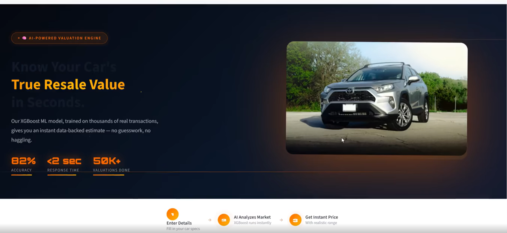
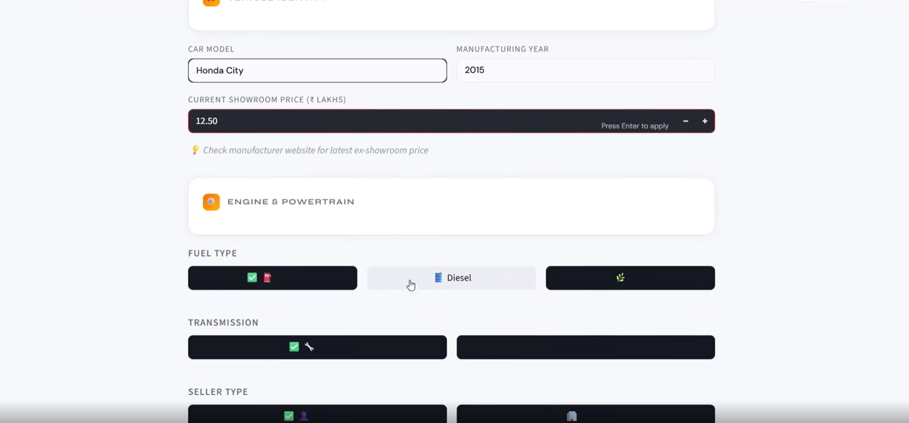
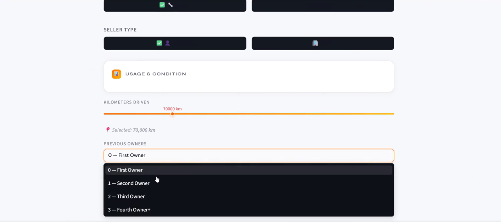
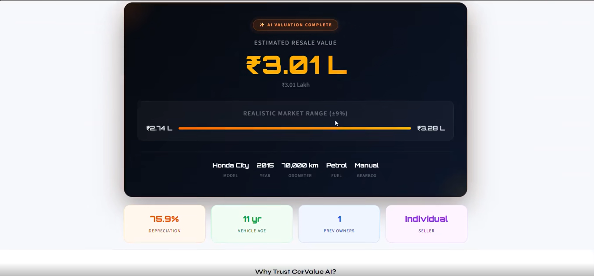

# 🚗 CarValue AI — Know Your Car's True Resale Value in Seconds

An end-to-end machine learning application that predicts a used car's fair resale value using **XGBoost**, served through a **FastAPI backend** and a fully animated, cinematic **Streamlit frontend**.

**🎥 Demo Video:** [Watch on LinkedIn](https://lnkd.in/p/dWevaJei)

---

## 📸 Preview

| Landing | Vehicle & Engine Details |
|---|---|
|  |  |

| Usage & Condition | Estimated Resale Value |
|---|---|
|  |  |

---

## 📋 Overview

CarValue AI takes a handful of details about a used car — make, year, mileage, fuel type, transmission, ownership history — and returns an instant, data-backed resale estimate with a realistic market range, instead of a single rigid number. It's built as a proper two-service architecture rather than a single monolithic script:

- A **FastAPI service** handles preprocessing and inference behind a clean REST endpoint
- A **Streamlit app** consumes that API and delivers the actual user experience, with a fully custom-designed, animated UI (Three.js particle canvas, 3D card tilt, magnetic buttons, shimmer text)

### Key Features
- 🧠 **XGBoost regression model** trained on real used-car transaction data
- ⚡ **Sub-2-second predictions** via a dedicated FastAPI inference service
- 📊 **Realistic price range (±9%)** instead of a single misleading number — because real resale markets have variance
- 🎨 **Fully custom, animated frontend** — WebGL particle background, 3D tilt cards, live depreciation & vehicle-age insights
- 🔒 **Privacy-first** — no data is stored; every computation is server-side and discarded immediately
- 🧩 **Clean separation of concerns** — Pydantic schema validation, isolated preprocessing pipeline, and a reusable model-loading layer

---

## 🧠 Model Details

| Parameter | Detail |
|---|---|
| Algorithm | XGBoost Regressor |
| Dataset | CarDekho used car listings — 301 records |
| Target | Selling Price (₹ Lakhs) |
| Features | Car age, present price, kms driven, fuel type, seller type, transmission, ownership count |
| Preprocessing | One-hot encoding (fuel/seller/transmission) + StandardScaler on numerical features |
| **Reported Accuracy** | **~82%** |
| Framework | Scikit-learn (preprocessing), XGBoost, Joblib |

**Engineered feature:** `Car_Age` is derived from the manufacturing year at inference time rather than passed in raw, which is what the "Vehicle is 11 years old — auto-factored into the AI model" note in the UI reflects.

---

## 🏗️ Architecture

```
┌─────────────────────┐        POST /predict        ┌──────────────────────┐
│   Streamlit Frontend │ ───────────────────────────▶│   FastAPI Backend     │
│   (streamlit_app.py) │                              │   (main.py)           │
│                       │ ◀─────────────────────────  │                       │
└─────────────────────┘        JSON response          └──────────┬───────────┘
                                                                    │
                                                      ┌─────────────▼─────────────┐
                                                      │  model.py — preprocessing  │
                                                      │  + XGBoost inference       │
                                                      └─────────────┬─────────────┘
                                                                    │
                                                    xgb_model.pkl · scaler.pkl · feature_columns.pkl
```

The frontend and backend run as **two independent processes** — a design choice that mirrors how ML services are deployed in production, rather than bundling everything into one Streamlit script.

---

## 🛠️ Tech Stack

- **Backend:** FastAPI, Pydantic (schema validation), Uvicorn
- **ML:** XGBoost, Scikit-learn, Joblib
- **Frontend:** Streamlit, custom CSS/JS, Three.js (animated hero canvas)
- **Data Processing:** Pandas, NumPy

---

## 📂 Project Structure

```
├── main.py                # FastAPI app & routes
├── model.py                # Model loading, preprocessing, inference logic
├── schema.py                # Pydantic request/response schemas
├── streamlit_app.py        # Streamlit frontend
├── xgb_model.pkl             # Trained XGBoost model
├── scaler.pkl                 # Fitted StandardScaler
├── feature_columns.pkl         # Feature column order used at inference
├── cardekho_data.csv            # Training dataset
├── requirements.txt
└── README.md
```

---

## 🚀 Getting Started

### 1. Clone the repository
```bash
git clone https://github.com/<your-username>/CarValue-AI-Price-Predictor.git
cd CarValue-AI-Price-Predictor
```

### 2. Install dependencies
```bash
pip install -r requirements.txt
```

### 3. Start the FastAPI backend
```bash
uvicorn main:app --reload --port 8000
```

### 4. Start the Streamlit frontend (in a second terminal)
```bash
streamlit run streamlit_app.py
```

The app will open at `http://localhost:8501` and communicate with the API at `http://127.0.0.1:8000/predict`.

### API Example
```bash
curl -X POST "http://127.0.0.1:8000/predict" \
  -H "Content-Type: application/json" \
  -d '{
    "Car_name": "Honda City",
    "Year": 2015,
    "Present_Price": 12.50,
    "Kms_Driven": 70000,
    "Fuel_Type": "Petrol",
    "Seller_Type": "Individual",
    "Transmission": "Manual",
    "Owner": 1
  }'
```

---

## ⚠️ Disclaimer

Built for **educational and portfolio purposes**. Predictions are estimates based on a limited historical dataset and should not be used as a substitute for a professional valuation. CarValue AI is **not affiliated with Cars24, CarDekho, or Spinny**.

---

## 📈 Future Improvements

- [ ] Deploy both services (Streamlit Cloud + Render/Railway for the API)
- [ ] Add model explainability (SHAP) to show which factors drove a specific valuation
- [ ] Expand training data beyond 301 records for better generalization
- [ ] Add authentication & rate limiting to the FastAPI service
- [ ] Containerize with Docker Compose (one command to run both services)

---

## 👤 Author

**Mohit Jadav**
[LinkedIn](https://www.linkedin.com/in/mohit-jadav-)

---

## 📄 License

This project is licensed under the MIT License.